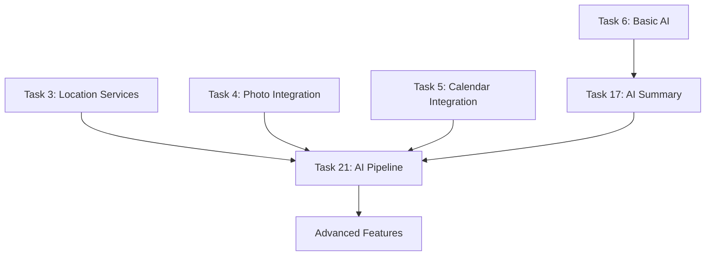

# AI Implementation Roadmap for Aura One

## Overview
This document outlines the comprehensive roadmap for implementing local AI capabilities in the Aura One journaling application, based on the detailed AI-SPEC.md specifications.

## Implementation Timeline

### Phase 1: Foundation (Tasks 6, 17)
**Status**: ✅ Complete
- Basic on-device AI infrastructure
- Initial AI summary generation
- Integration with Today's Summary UI

### Phase 2: Advanced AI Pipeline (Task 21)
**Status**: 🔄 In Progress
- Multi-modal AI pipeline implementation
- Spatiotemporal data processing
- Visual context extraction
- Advanced narrative generation

## Task 21 Breakdown: Local AI Models for Daily Summary Generation

### Technical Architecture
The implementation follows a sequential 6-step pipeline:

1. **TensorFlow Lite Integration** (21.1)
   - Core infrastructure setup
   - Native platform configuration
   - Asset management for models

2. **Location Intelligence** (21.2)
   - DBSCAN clustering algorithm
   - Stay point identification
   - Journey classification

3. **Activity Recognition** (21.3)
   - CNN-LSTM model integration
   - Real-time activity classification
   - IMU sensor data processing

4. **Visual Understanding** (21.4)
   - Image captioning models (LightCap)
   - Photo context extraction
   - Visual narrative generation

5. **Data Fusion** (21.5)
   - Multi-modal event correlation
   - Timeline unification
   - Context-aware data structures

6. **Text Generation** (21.6)
   - Small Language Model integration
   - Prompt engineering
   - Narrative synthesis

7. **Production Optimization** (21.7)
   - Hardware acceleration
   - Performance tuning
   - Battery optimization

### Dependencies and Integration Points



### Key Technical Components

#### Models Required
- **DBSCAN Algorithm**: Custom Dart implementation
- **HAR Model**: CNN-LSTM for activity recognition (.tflite)
- **Image Captioning**: LightCap or similar (.tflite)
- **Language Model**: Phi-3 Mini or TinyLlama (.tflite)

#### Data Pipeline
```
Raw Sensor Data → Processing → Fusion → AI Generation → User Interface
      ↓              ↓           ↓           ↓              ↓
  GPS + IMU +    Location +   DailyEvent   Summary      Today's Summary
   Photos      Activities    Timeline      Text          Display
```

### Performance Targets
- **Memory Usage**: < 500MB peak during inference
- **Processing Time**: < 30 seconds for daily summary
- **Battery Impact**: < 5% additional daily usage
- **Model Loading**: < 5 seconds cold start

### Privacy Guarantees
- ✅ All processing on-device
- ✅ No data transmission to servers
- ✅ User-controlled data retention
- ✅ Transparent permission handling

## Implementation Strategy

### Development Approach
1. **Sequential Implementation**: Follow AI-SPEC.md step-by-step
2. **Incremental Testing**: Validate each component before proceeding
3. **Performance Monitoring**: Continuous benchmarking throughout development
4. **Fallback Systems**: Ensure graceful degradation for edge cases

### Quality Assurance
- **Unit Testing**: Each AI component individually tested
- **Integration Testing**: End-to-end pipeline validation
- **Performance Testing**: Device capability benchmarking
- **User Testing**: Summary quality evaluation

### Risk Mitigation
- **Model Size**: Progressive loading and quantization
- **Device Compatibility**: Hardware acceleration fallbacks  
- **Performance Issues**: Background processing optimization
- **Quality Control**: Template-based fallbacks

## Success Criteria

### Technical Success
- [ ] All 7 subtasks completed successfully
- [ ] Performance targets met across device range
- [ ] Battery impact within acceptable limits
- [ ] 95%+ summary generation success rate

### User Experience Success
- [ ] High-quality, relevant daily summaries
- [ ] Seamless integration with existing UI
- [ ] Positive user feedback on summary quality
- [ ] Adoption of AI-generated summaries

### Business Success
- [ ] Differentiated feature vs competitors
- [ ] Increased user engagement and retention
- [ ] Enhanced journaling experience
- [ ] Foundation for future AI features

## Future Roadmap

### Phase 3: Advanced Features
- Custom model fine-tuning
- Multi-language support
- Advanced visual understanding
- Predictive insights

### Phase 4: Ecosystem Integration
- Voice integration enhancement
- Cross-platform synchronization
- Third-party API integrations
- Advanced analytics

## Resources and References

### Technical Documentation
- [AI-SPEC.md](../../../AI-SPEC.md) - Detailed implementation specifications
- [Task 21 Documentation](./task_21_local_ai_models.md) - Complete task breakdown
- [TensorFlow Lite Flutter Guide](https://pub.dev/packages/tflite_flutter)

### Model Resources
- Microsoft Phi-3 Mini: Optimized small language model
- TinyLlama: Ultra-efficient LLM for mobile
- LightCap: Efficient image captioning for edge devices
- Custom HAR models: Activity recognition for mobile devices

### Community and Support
- TensorFlow Lite Community
- Flutter AI/ML Special Interest Group
- Mobile ML Research Papers
- Open Source Model Repositories

---

*This roadmap is a living document that will be updated as implementation progresses and new requirements emerge.*